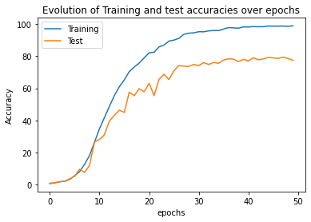

# Computer-Vision---Stanford-Car-Dataset-- Classification

Check Notebook for detailed comments and results. 

In this project, we will build a Neural Network to solve the Car classification problem in the Stanford car dataset, available on https://www.kaggle.com/jutrera/stanford-car-dataset-by-classes-folder  (Download this folder and put it directly in the folder of the notebook to run all experiments).

The dataset is already split into train and test sets.

The dataset is prelabelled, and has predefined bounding boxes, so we will not need to train your model for object recognition.

The first step would be to crop all images contained in both training and test sets using the predefining boxes, and to grayscale all the images.

We end up with a directory (cropped data) that contains two folds (Train and Test) and where we also created one directory containing all images included in a given class of image (i.e. Make, Model, Year).

The main constraint that we do have in this project is that we cannot use pre-trained Deep Convolutional Networks, this means that we restrain ourselves from using a Transfer Learning approach and we do have to train a whole NN from scratch.

We achieve 80% accuracy on the test set.

